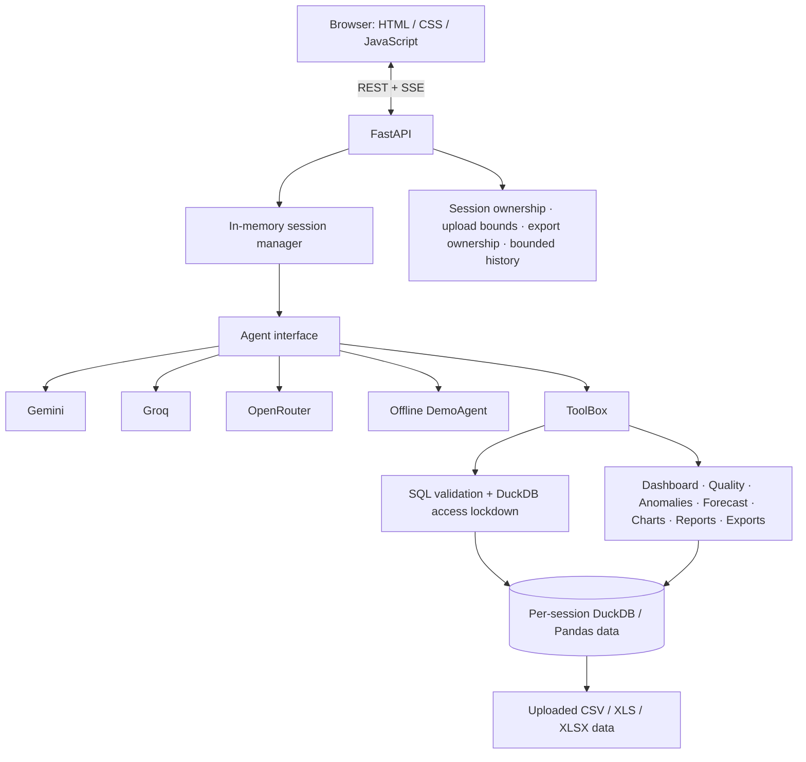

# AskCSV — AI Data Analyst

## Project Overview

AskCSV is a browser-based analyst for CSV and Excel data. Load a file, ask a business question in natural language, and review the generated read-only SQL, results, charts, and explanatory summary. It is designed for quick exploration of small datasets, including follow-up questions, without requiring users to write SQL themselves.

**Live application:** [https://ask-csv.fastapicloud.dev](https://ask-csv.fastapicloud.dev)

The frontend is plain HTML, CSS, and JavaScript served by FastAPI. The project has no npm build pipeline.

## Demo Video

**Demo video:** [Watch the AskCSV Demo](https://drive.google.com/file/d/13e3eB8YVjyLibMiZo6psSu10Wgmb4J0o/view?usp=sharing)

The video should show a sample CSV upload, a natural-language question, and the resulting analysis with SQL, chart, and explanation.

## Screenshots

The repository includes UI captures for these existing screens:

**Workspace and dataset list**


**Chat answer with analysis output**


**Dashboard overview**


Other captures: [upload](screenshot/upload.png), [spreadsheet](screenshot/spreadsheet.png), [data quality](screenshot/data-quality.png), [anomalies](screenshot/anomalies.png), [forecast](screenshot/forecast.png), [report](screenshot/report.png), [observability](screenshot/observability.png), [settings](screenshot/settings.png), and [mobile layout](screenshot/mobile.png).

## Features and Assignment Coverage

| Area | AskCSV implementation |
|---|---|
| Data upload | CSV, XLS, and XLSX ingestion; workbook sheets are represented as tables where supported. Upload size, file count, and batch limits are enforced. |
| Natural-language analysis | Gemini, Groq, OpenRouter, or an offline deterministic DemoAgent can answer supported questions using validated tools. |
| SQL and results | The agent can generate and execute read-only DuckDB SQL. The chat stream can show SQL, result data, charts, and a natural-language explanation. |
| Conversation | Session-scoped, bounded recent history supports follow-up questions; starting a new chat clears conversation context while retaining the dataset. |
| Visual analysis | Plotly chart specifications and dashboard summaries, with separate views for data quality, statistical anomalies, forecasts, and reports. |
| Multi-file work | Tables in one session can be analyzed together with SQL joins. |
| Export | Query results can be exported as session-owned CSV files. |
| Streaming | Chat events are returned using Server-Sent Events (SSE). |
| Verification | pytest suite and 12 deterministic fixed-fixture evaluation cases; provider tests use mocks rather than live provider calls. |

**Scope notes:** anomaly detection uses IQR or z-score statistics; forecasting is a linear trend projection. Evaluation verifies deterministic behavior and does not score live LLM quality. Semantic search and authentication are not implemented. See the [assignment matrix](docs/ASSIGNMENT_MATRIX.md) for fuller evidence and partial items.

## Architecture



See [architecture documentation](docs/architecture.md) for the component and security-boundary diagrams.

## API Endpoints Reference

These routes are declared by the FastAPI application in `app/main.py`. Chat is streamed as Server-Sent Events; other listed responses are JSON unless described otherwise.

| Method | Endpoint | Inputs | Response or behavior |
|---|---|---|---|
| `GET` | `/api/health` | None | Health and provider-mode metadata; does not return credentials. |
| `GET` | `/api/config` | None | Current provider/model configuration and key-presence indicators. |
| `POST` | `/api/config/switch` | JSON: required `provider` (`gemini`, `groq`, `openrouter`, or `demo`; handler also accepts `auto`); optional `model`, `api_key`, `session_id` | Applies provider settings for the session and returns configuration status. Runtime key overrides can be disabled by configuration. |
| `POST` | `/api/upload` | Multipart form with one or more `files` entries | Ingests CSV, XLS, or XLSX files and returns the created session and table metadata. |
| `POST` | `/api/sample` | None | Loads the bundled `data/sales.csv` sample into a new session. |
| `POST` | `/api/chat` | JSON: `session_id`, `message`; optional `provider`, `model` | Streams chat events as `text/event-stream`, including analysis events and completion. |
| `POST` | `/api/chat/new` | JSON: `session_id` | Clears that session's conversation history while retaining its datasets. |
| `GET` | `/api/schema/{sid}/{table}` | Path: `sid`, `table` | Returns the selected table's schema/profile. |
| `GET` | `/api/preview/{sid}/{table}` | Path: `sid`, `table`; query: `limit` (default 500), `offset` (default 0) | Returns a paginated table preview, schema, and row count. |
| `GET` | `/api/dashboard/{sid}/{table}` | Path: `sid`, `table` | Returns dashboard summary data for the selected table. |
| `GET` | `/api/quality/{sid}/{table}` | Path: `sid`, `table` | Returns data-quality findings for the selected table. |
| `GET` | `/api/forecast/{sid}/{table}` | Path: `sid`, `table`; optional query: `date_col`, `metric_col`, `periods` (default 6) | Returns a linear forecast or a controlled validation/error response. |
| `GET` | `/api/report/{sid}/{table}` | Path: `sid`, `table` | Returns a generated report/summary for the selected table. |
| `GET` | `/api/logs/{sid}` | Path: `sid` | Returns session-scoped operational/query metadata. |
| `GET` | `/api/exports/{sid}/{filename}` | Path: `sid`, session-owned CSV `filename` | Streams a CSV export only when it belongs to the requested session. |

AskCSV does not expose a separate arbitrary-SQL HTTP route; SQL execution is mediated through the chat agent's tools and query validation.

## Project Structure

The following tree lists the main tracked project files (omitting individual historical change notes and vendored library internals):

```text
ask-csv/
├── app/                         # FastAPI application and analysis logic
│   ├── main.py                  # Routes, session lifecycle, upload and download handling
│   ├── engine.py                # Per-session DuckDB data access and SQL validation
│   ├── tools.py                 # Agent-callable analysis and export tools
│   ├── agent.py                 # Agent interface/provider selection
│   ├── groq_agent.py            # Groq tool-calling provider adapter
│   ├── openrouter_agent.py      # OpenRouter integration
│   ├── demo_agent.py            # Offline deterministic analyst
│   ├── conversation.py          # Bounded conversation history
│   ├── config.py                # Environment-backed configuration
│   ├── analytics.py             # Dashboard and data-quality calculations
│   ├── anomalies.py             # Statistical anomaly detection
│   ├── charts.py                # Chart specification generation
│   └── provider_errors.py       # Provider error normalization
├── frontend/
│   ├── index.html               # Single-page application shell
│   ├── css/app.css              # Existing frontend styling
│   ├── js/app.js                # Browser interactions and API/SSE client
│   └── vendor/                  # Bundled Plotly and Tabulator assets
├── data/
│   ├── sales.csv                # Bundled synthetic retail sample
│   └── make_sample_dataset.py   # Regenerates the sample data
├── screenshot/                  # Existing application screenshots
├── tests/                       # API, engine, security, feature and lifecycle tests
│   └── evaluation/              # Deterministic fixed-fixture evaluation suite
├── docs/
│   ├── architecture.md          # Architecture and boundary diagrams
│   ├── ASSIGNMENT_MATRIX.md     # Requirement-to-evidence mapping
│   ├── FINAL_AUDIT.md           # Final submission audit
│   └── changes/                 # Per-chunk implementation and verification notes
├── requirements.txt             # Runtime dependencies
├── requirements-dev.txt         # Development/test dependencies
├── .env.example                 # Safe configuration names and placeholders
├── Dockerfile                   # Container image definition
├── docker-compose.yml           # Local container configuration
└── render.yaml                  # Alternative Render service blueprint
```

## Technology Stack

- **Backend:** Python, FastAPI, DuckDB, Pandas
- **Frontend:** HTML, CSS, and JavaScript, served from the FastAPI application
- **AI providers:** Google Gemini, Groq, and OpenRouter, with an offline DemoAgent when no selected provider key is configured
- **Testing:** pytest, deterministic local evaluation fixtures, and mocked provider tests

## How to Use AskCSV

1. Open the [live application](https://ask-csv.fastapicloud.dev), or start it locally using the setup steps below.
2. Choose **Load sample dataset** to load `data/sales.csv`, or use **Upload** to select CSV/XLS/XLSX files.
3. Ask a question about the visible table, for example: “Which region generated the highest revenue?”
4. Review the answer, any generated SQL/result and chart, and the accompanying natural-language explanation.
5. Ask a related follow-up, such as “How much did it generate?” to use recent conversation context.
6. Use the Dashboard, Data Quality, Forecast, and Report views for the corresponding deterministic analyses.

## Conversation Context

Each session retains a bounded recent history (12 turns by default). Gemini receives provider-specific messages; Groq and OpenRouter use the OpenAI-compatible chat-completions tool protocol. DemoAgent uses the same session’s recent exchanges to resolve supported follow-up references. `/api/chat/new` clears conversation history while keeping that session’s datasets. Session state is in memory and is lost on restart.

## Analytics Methods

- Anomaly detection uses statistical IQR or z-score rules; it is not machine-learning anomaly detection.
- Forecasting fits a linear trend and reports a residual-spread band. It does not model seasonality or provide a guarantee of predictive accuracy.
- Dashboard, quality, chart, and report views use the uploaded data and deterministic application logic.

## Security and Design Decisions

- Uploads are streamed and bounded (50 MB per file by default); a new upload session is limited to 200 MB and 20 files per upload batch. Generated exports are limited to 200 MB and 20 files per session.
- Session storage retention defaults to 24 hours; in-memory session capacity defaults to 200. Cleanup is local to this single-process application.
- Table and SQL validation guard read queries, reject write statements and external readers, and DuckDB external access is disabled.
- Dataset contents, schema names, and tool outputs are treated as untrusted prompt data. This mitigates prompt injection; no prompt-based defense can guarantee that every malicious instruction will be ignored.
- Conversation history is bounded to 12 turns; agent tool execution is bounded to 8 steps per question.
- Generated exports are session-owned and CSV formula-like text is neutralized when exported.
- Session IDs are bearer capabilities: anyone who obtains one can act as that session. There is no user authentication or account system.
- Sessions and provider overrides are process-local. Local uploads/exports are not durable shared storage and are not suitable for multi-worker coordination without an external shared session/storage design.
- `/api/config` reports provider/model and key-presence status, not credential values. Set `ALLOW_KEY_OVERRIDE=false` on deployments where provider keys must come only from the environment.

See [environment variables](#environment-configuration) and [known limitations](#known-limitations).

## Environment Configuration

Copy `.env.example` to `.env` if you want to configure the application. Leave keys empty for offline demo mode. Never commit `.env` or put real credentials in `.env.example`.

| Variable | Default | Purpose |
|---|---|---|
| `LLM_PROVIDER` | `openrouter` | Preferred provider; without configured keys the application uses DemoAgent. |
| `OPENROUTER_API_KEY` | empty | OpenRouter credential. |
| `OPENROUTER_MODEL` | `openai/gpt-4o-mini` | OpenRouter model identifier. |
| `GEMINI_API_KEY` | empty | Google Gemini credential. |
| `GEMINI_MODEL` | `gemini-3.6-flash` | Gemini model identifier. |
| `GROQ_API_KEY` | empty | Groq credential. Store this as a secret in hosted deployments. |
| `GROQ_MODEL` | `openai/gpt-oss-20b` | Groq model ID; supports local function/tool use in Groq's API. |
| `MAX_ROWS_TO_LLM` | `20` | Maximum result rows sent to a provider. |
| `MAX_UPLOAD_MB` | `50` | Per-file upload limit. |
| `MAX_SESSION_UPLOAD_MB` | `200` | Aggregate uploaded bytes for the upload batch that creates a session. |
| `MAX_SESSION_EXPORT_MB` | `200` | Aggregate generated export bytes per session. |
| `MAX_FILES_PER_SESSION` | `20` | Uploaded file count limit per session. |
| `MAX_EXPORTS_PER_SESSION` | `20` | Generated export count limit per session. |
| `SESSION_STORAGE_RETENTION_HOURS` | `24` | Session-associated local storage retention. |
| `ALLOWED_ORIGINS` | `http://localhost:8000,http://127.0.0.1:8000` | Comma-separated browser origins accepted by CORS. |
| `ALLOW_KEY_OVERRIDE` | `true` | Allows session provider settings to accept key overrides via the settings API; use `false` for environment-only keys. |

`MAX_TOOL_STEPS=8`, `MAX_CONVERSATION_TURNS=12`, and `SESSION_LIMIT=200` are code defaults rather than environment variables.

## Quickstart and Local Setup

```powershell
git clone https://github.com/mayankrajray/ask-csv.git
Set-Location ask-csv
python -m venv .venv
.\.venv\Scripts\Activate.ps1
python -m pip install -r requirements.txt
python -m pip install -r requirements-dev.txt
Copy-Item .env.example .env  # Optional; edit only with your own credentials.
python -m uvicorn app.main:app --host 127.0.0.1 --port 8000 --reload
```

On Windows, open <http://127.0.0.1:8000>. The frontend is served by FastAPI; there is no separate frontend build command. Health check: <http://127.0.0.1:8000/api/health>.

On macOS or Linux, activate the environment with `source .venv/bin/activate`, then use `python -m pip install -r requirements.txt`, `python -m pip install -r requirements-dev.txt`, and `python -m uvicorn app.main:app --host 127.0.0.1 --port 8000 --reload`.

Copying `.env.example` to `.env` is optional for local setup. Leave provider keys blank to use DemoAgent, or enter your own provider key locally in the untracked `.env` file. Never commit that file.

Run tests and the deterministic evaluation:

```powershell
.\.venv\Scripts\python.exe -m pytest -q
.\.venv\Scripts\python.exe -m pytest tests/evaluation -v
```

The evaluation contains 12 fixed-fixture deterministic cases. It makes no live LLM calls. Provider integration is mock-tested separately; these checks do not measure live Gemini/OpenRouter answer quality and are not a general benchmark.

## Docker

With Docker Desktop’s Linux engine running:

```powershell
docker compose build
docker compose up
```

Then visit <http://localhost:8000>. Configure provider variables in an untracked `.env` file if needed. The compose service maps the local `data/` directory into the container; sessions remain in memory, and uploads/exports use the container’s local filesystem. The image does not include `.env` or development files in its build context.

## Deployment

The current live deployment is hosted on FastAPI Cloud Hobby at [https://ask-csv.fastapicloud.dev](https://ask-csv.fastapicloud.dev). It uses a Free instance and is configured for Gemini. Provider credentials are stored as dashboard secrets; never add credentials to the repository. OpenRouter is configured as a provider credential, but automatic Gemini-to-OpenRouter failover is not implemented. If no usable provider key is configured, AskCSV can run with its offline DemoAgent.

The frontend and API are served from the same origin. The live service is limited to one maximum replica; Hobby scales to zero while idle, so the first request after idle may take longer and in-memory sessions can be lost on restart or scale-down. `/api/health` reports the active provider mode and key-presence flags without returning key values.

To move the live service to Groq, set `LLM_PROVIDER=groq` and add `GROQ_API_KEY` as a secret in FastAPI Cloud, then redeploy. Set `GROQ_MODEL` only if choosing another supported Groq model. The deployed service remains on its currently configured provider until those dashboard settings are changed and a deployment completes. Groq is opt-in; a missing Groq key selects DemoAgent rather than switching to Gemini or OpenRouter. Request failures do not trigger cross-provider fallback. Groq usage is subject to the account's model availability, rate limits, and pricing; see [Groq supported models and pricing](https://console.groq.com/docs/models) and [tool-use support](https://console.groq.com/docs/tool-use/overview).

`render.yaml` remains in the repository as an alternative deployment configuration; it is not the current live host. Its one-service setup installs `requirements.txt`, runs Uvicorn, and checks `/api/health`.

The deployment is intended for a controlled demo with non-sensitive datasets. No authentication is provided. Uploaded files and exports use local storage and may be ephemeral; do not use private datasets.

## Sample Data

`data/sales.csv` is a small retail dataset for the demo and bundled sample action. The data includes deliberate quality/anomaly examples. Rebuild it with `python data/make_sample_dataset.py`.

Its columns are `order_id`, `order_date`, `region`, `city`, `category`, `product`, `customer`, `quantity`, `unit_price`, `revenue`, and `channel`. Upload it from the **Upload** tab or use **Load sample dataset** in the app. Example questions:

- Which region generated the highest revenue?
- How does revenue vary by product category?
- What were the monthly revenue trends?
- Are there unusual revenue values?
- How much revenue did the top region generate? (follow-up context)

## 3–5 Minute Demo Flow

1. Load the sample or upload a CSV, then show the dataset workspace and schema.
2. Ask which region has the highest sales; show the answer, SQL, and result.
3. Ask “How much did it sell?” to demonstrate follow-up context.
4. Open a chart/dashboard and then inspect quality and anomaly views.
5. Run a forecast on the time-series sample or a date/metric pair.
6. Upload a second related file, join it with the first, and export the result.

For screenshots, capture genuine application states: upload/data workspace, question with visible SQL/result, chart/dashboard, quality/anomaly, multi-file/join, and export result. The `screenshot/` directory contains existing project images; replace or supplement them only with real current UI captures. A video can follow the numbered sequence above.

## Assignment requirement matrix

See [docs/ASSIGNMENT_MATRIX.md](docs/ASSIGNMENT_MATRIX.md) for the implementation/evidence mapping and honest status of optional items.

## Known limitations

- Session IDs act as bearer capabilities; there is no authentication.
- Session data/configuration are in memory, and local storage is single-process rather than durable or multi-worker shared storage.
- Prompt injection defenses are mitigations, not a proof of immunity.
- DemoAgent handles a defined range of common analysis questions; it is not a general language model.
- Forecasting is linear projection; anomaly detection is statistical.
- The 12-case evaluation is deterministic and fixed-fixture; it does not measure live LLM quality.
- Docker build/runtime verification depends on a running Docker Desktop engine. See the latest integration change record for this environment’s validation result.

## Testing and Verification

For the Groq integration working-tree verification, the full suite completed with **164 passed, 2 skipped** and the evaluation suite with **12 passed**. `pip check` reported no broken requirements, `node --check frontend/js/app.js` passed, and `git diff --check` passed. Pytest emitted one Starlette/httpx deprecation warning. Provider tests use mocks; these results do **not** verify live Groq credentials or a deployment. Docker CLI is installed, but its Linux engine was unavailable, so image build/runtime were not verified. The live homepage and `/api/health` results below are historical checks from the earlier submission-preparation run, not rechecked for this provider change; both returned HTTP 200 and health reported Gemini mode. See [docs/changes/011-integration-submission-readiness.md](docs/changes/011-integration-submission-readiness.md) for that run's record and [docs/changes/012-groq-provider.md](docs/changes/012-groq-provider.md) for this integration's verification record.

```powershell
python -m pytest -q
python -m pytest tests/evaluation -v
python -m pip check
```
