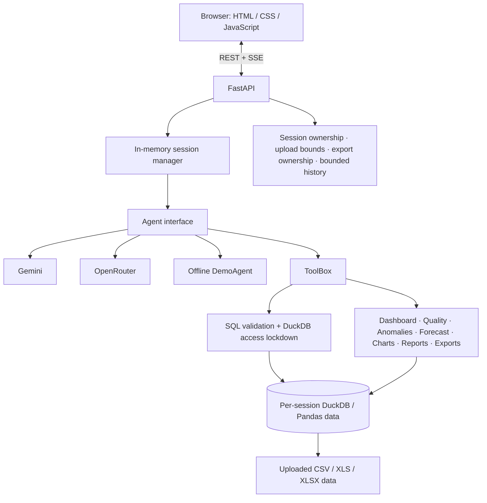
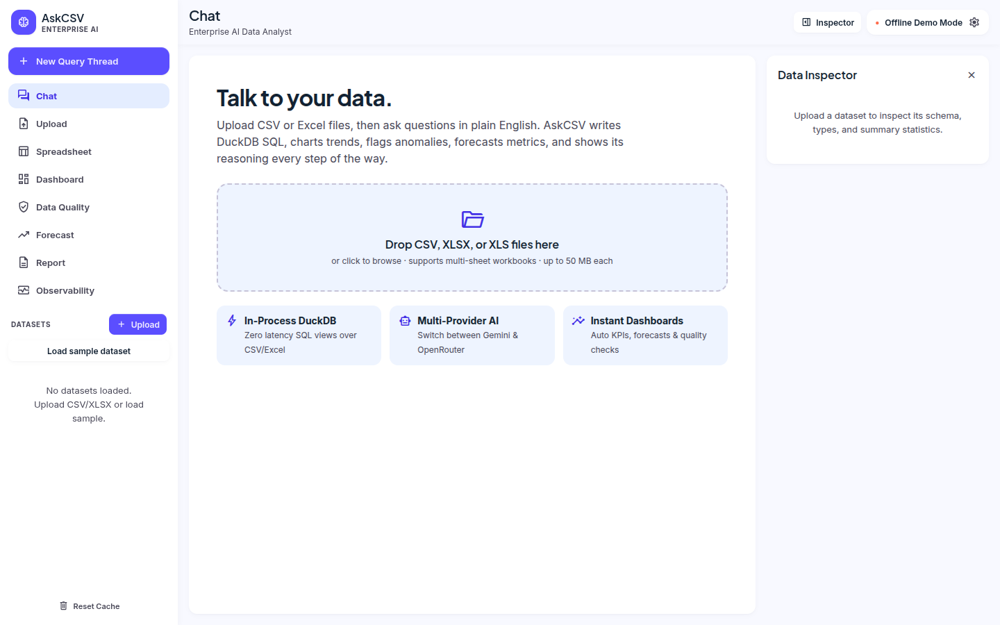
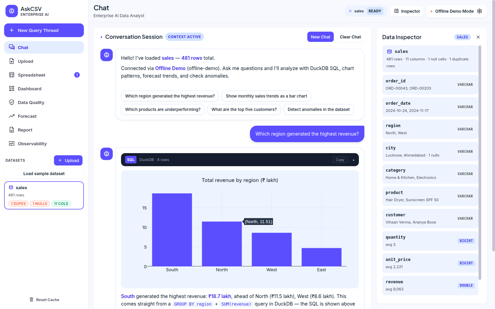
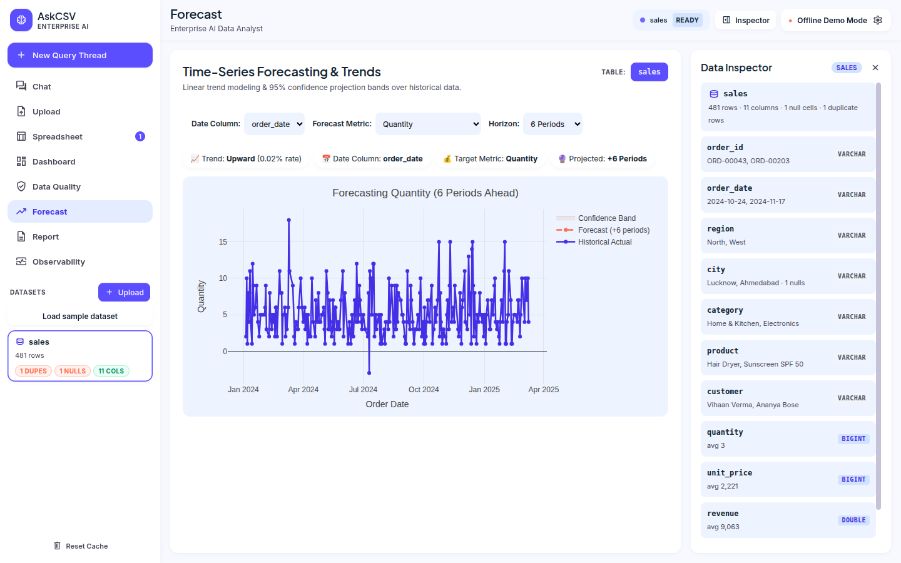
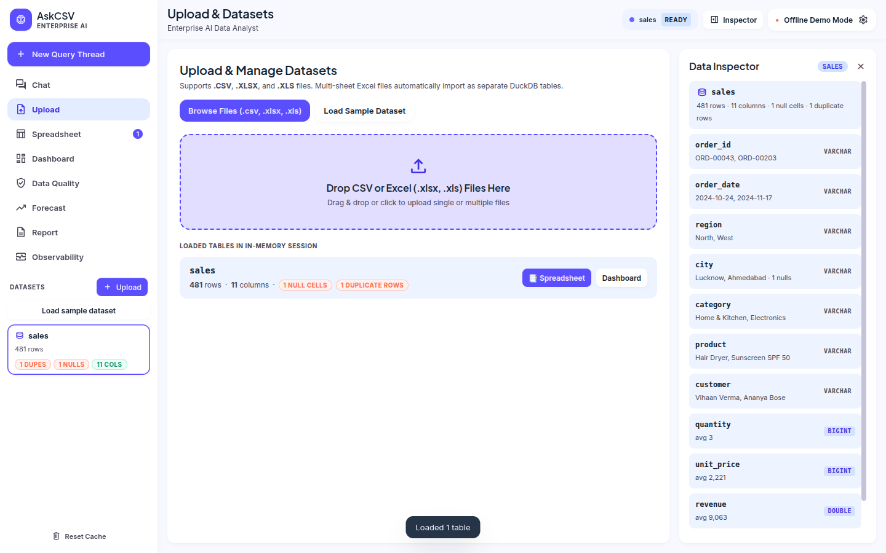
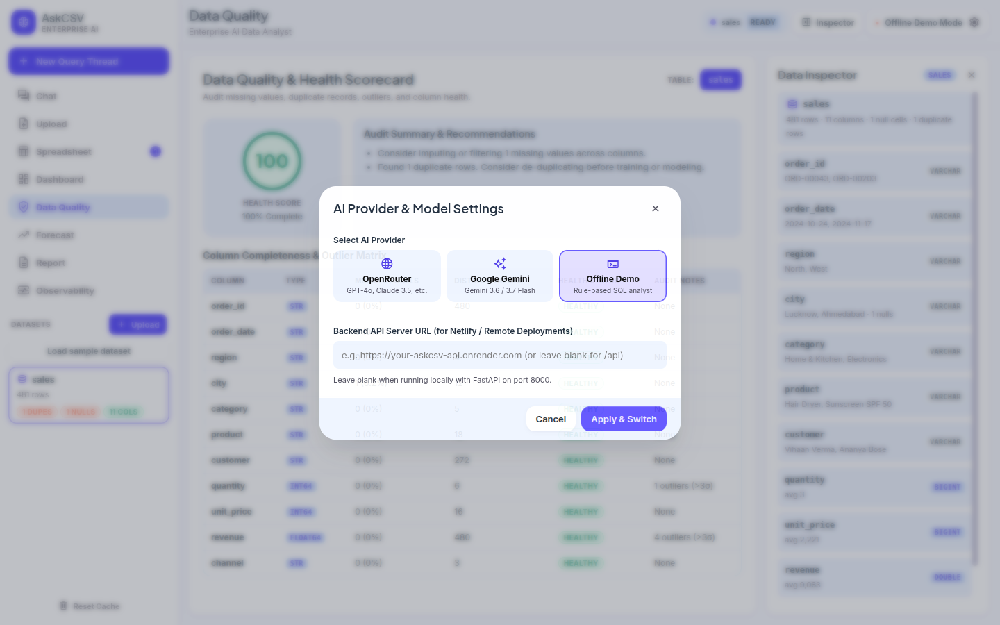

# AskCSV — AI Data Analyst

AskCSV is a browser-based data analyst for CSV and Excel workbooks. Upload one or more files, ask questions in natural language, and inspect the SQL, results, charts, and analytical views. It supports an offline DemoAgent as well as Gemini and OpenRouter providers.

This repository is prepared as an AI Engineer assignment submission. The application uses a vanilla HTML/CSS/JavaScript frontend served by FastAPI; it has no npm build step.

**Live demo:** [https://ask-csv.fastapicloud.dev](https://ask-csv.fastapicloud.dev)

## Key features

- CSV, XLS, and XLSX ingestion; workbook sheets become separate tables where supported.
- Multiple datasets in a session, including SQL joins across tables.
- Natural-language analysis through Gemini, OpenRouter, or the deterministic offline DemoAgent.
- Bounded multi-turn conversation context and streamed chat events (Server-Sent Events).
- DuckDB SQL analysis with read-only validation and external file/network access disabled.
- Dashboard summaries, data-quality checks, IQR/z-score anomaly detection, linear-trend forecasting, chart specifications, reports, and CSV result exports.
- Session-scoped provider configuration, upload/export limits, file ownership, and deterministic evaluation tests.

## Architecture



See [architecture documentation](docs/architecture.md) for the component and security-boundary diagrams.

## Technology stack

- **Backend:** Python, FastAPI, DuckDB, Pandas
- **Frontend:** HTML, CSS, and JavaScript, served from the FastAPI application
- **AI providers:** Google Gemini and OpenRouter, with an offline DemoAgent when no usable provider key is configured
- **Testing:** pytest, deterministic local evaluation fixtures, and mocked provider tests

## Screenshots

These existing project screenshots show the main application workflows:

| Workspace | Analysis | Dashboard |
|---|---|---|
|  |  |  |

| Upload | Data quality | Forecast |
|---|---|---|
|  |  |  |

Additional captures are in [`screenshot/`](screenshot/), including the spreadsheet, report, observability, settings, and mobile views.

## Conversation context

Each session retains a bounded recent history (12 turns by default). Gemini and OpenRouter receive provider-appropriate conversation messages; DemoAgent uses the same session’s recent exchanges to resolve supported follow-up references. `/api/chat/new` clears conversation history while keeping that session’s datasets. Session state is in memory and is lost on restart.

## Analytics methods

- Anomaly detection uses statistical IQR or z-score rules; it is not machine-learning anomaly detection.
- Forecasting fits a linear trend and reports a residual-spread band. It does not model seasonality or provide a guarantee of predictive accuracy.
- Dashboard, quality, chart, and report views use the uploaded data and deterministic application logic.

## Security and operational limits

- Uploads are streamed and bounded (50 MB per file by default); a new upload session is limited to 200 MB and 20 files per upload batch. Generated exports are limited to 200 MB and 20 files per session.
- Session storage retention defaults to 24 hours; in-memory session capacity defaults to 200. Cleanup is local to this single-process application.
- Table and SQL validation guard read queries, reject write statements and external readers, and DuckDB external access is disabled.
- Dataset contents, schema names, and tool outputs are treated as untrusted prompt data. This mitigates prompt injection; no prompt-based defense can guarantee that every malicious instruction will be ignored.
- Conversation history is bounded to 12 turns; agent tool execution is bounded to 8 steps per question.
- Generated exports are session-owned and CSV formula-like text is neutralized when exported.
- Session IDs are bearer capabilities: anyone who obtains one can act as that session. There is no user authentication or account system.
- Sessions and provider overrides are process-local. Local uploads/exports are not durable shared storage and are not suitable for multi-worker coordination without an external shared session/storage design.
- `/api/config` reports provider/model and key-presence status, not credential values. Set `ALLOW_KEY_OVERRIDE=false` on deployments where provider keys must come only from the environment.

See [environment variables](#environment-configuration) and [known limitations](#known-limitations).

## Environment configuration

Copy `.env.example` to `.env` if you want to configure the application. Leave keys empty for offline demo mode. Never commit `.env` or put real credentials in `.env.example`.

| Variable | Default | Purpose |
|---|---|---|
| `LLM_PROVIDER` | `openrouter` | Preferred provider; without configured keys the application uses DemoAgent. |
| `OPENROUTER_API_KEY` | empty | OpenRouter credential. |
| `OPENROUTER_MODEL` | `openai/gpt-4o-mini` | OpenRouter model identifier. |
| `GEMINI_API_KEY` | empty | Google Gemini credential. |
| `GEMINI_MODEL` | `gemini-3.6-flash` | Gemini model identifier. |
| `MAX_ROWS_TO_LLM` | `20` | Maximum result rows sent to a provider. |
| `MAX_UPLOAD_MB` | `50` | Per-file upload limit. |
| `MAX_SESSION_UPLOAD_MB` | `200` | Aggregate uploaded bytes for the upload batch that creates a session. |
| `MAX_SESSION_EXPORT_MB` | `200` | Aggregate generated export bytes per session. |
| `MAX_FILES_PER_SESSION` | `20` | Uploaded file count limit per session. |
| `MAX_EXPORTS_PER_SESSION` | `20` | Generated export count limit per session. |
| `SESSION_STORAGE_RETENTION_HOURS` | `24` | Session-associated local storage retention. |
| `ALLOWED_ORIGINS` | `http://localhost:8000,http://127.0.0.1:8000` | Comma-separated browser origins accepted by CORS. |
| `ALLOW_KEY_OVERRIDE` | `true` | Allows session provider settings to accept key overrides via the settings API; use `false` for environment-only keys. |

`MAX_TOOL_STEPS=8`, `MAX_CONVERSATION_TURNS=12`, and `SESSION_LIMIT=200` are code defaults rather than environment variables.

## Setup and run (Windows PowerShell)

```powershell
git clone https://github.com/mayankrajray/ask-csv.git
Set-Location ask-csv
python -m venv .venv
.\.venv\Scripts\Activate.ps1
python -m pip install -r requirements.txt
python -m pip install -r requirements-dev.txt
Copy-Item .env.example .env  # Optional; edit only with your own credentials.
python -m uvicorn app.main:app --host 127.0.0.1 --port 8000 --reload
```

Open <http://127.0.0.1:8000>. The frontend is served by FastAPI; there is no separate frontend build command. Health check: <http://127.0.0.1:8000/api/health>.

Run tests and the deterministic evaluation:

```powershell
.\.venv\Scripts\python.exe -m pytest -q
.\.venv\Scripts\python.exe -m pytest tests/evaluation -v
```

The evaluation contains 12 fixed-fixture deterministic cases. It makes no live LLM calls. Provider integration is mock-tested separately; these checks do not measure live Gemini/OpenRouter answer quality and are not a general benchmark.

## Docker

With Docker Desktop’s Linux engine running:

```powershell
docker compose build
docker compose up
```

Then visit <http://localhost:8000>. Configure provider variables in an untracked `.env` file if needed. The compose service maps the local `data/` directory into the container; sessions remain in memory, and uploads/exports use the container’s local filesystem. The image does not include `.env` or development files in its build context.

## Deployment

The current live deployment is hosted on FastAPI Cloud Hobby at [https://ask-csv.fastapicloud.dev](https://ask-csv.fastapicloud.dev). It uses a Free instance and is configured for Gemini. Provider credentials are stored as dashboard secrets; never add credentials to the repository. OpenRouter is configured as a provider credential, but automatic Gemini-to-OpenRouter failover is not implemented. If no usable provider key is configured, AskCSV can run with its offline DemoAgent.

The frontend and API are served from the same origin. The live service is limited to one maximum replica; Hobby scales to zero while idle, so the first request after idle may take longer and in-memory sessions can be lost on restart or scale-down. `/api/health` reports the active provider mode and key-presence flags without returning key values.

`render.yaml` remains in the repository as an alternative deployment configuration; it is not the current live host. Its one-service setup installs `requirements.txt`, runs Uvicorn, and checks `/api/health`.

The deployment is intended for a controlled demo with non-sensitive datasets. No authentication is provided. Uploaded files and exports use local storage and may be ephemeral; do not use private datasets.

## Sample data

`data/sales.csv` is a small retail dataset for the demo and bundled sample action. The data includes deliberate quality/anomaly examples. Rebuild it with `python data/make_sample_dataset.py`.

Its columns are `order_id`, `order_date`, `region`, `city`, `category`, `product`, `customer`, `quantity`, `unit_price`, `revenue`, and `channel`. Upload it from the **Upload** tab or use **Load sample dataset** in the app. Example questions:

- Which region generated the highest revenue?
- How does revenue vary by product category?
- What were the monthly revenue trends?
- Are there unusual revenue values?
- How much revenue did the top region generate? (follow-up context)

## 3–5 minute demo flow

1. Load the sample or upload a CSV, then show the dataset workspace and schema.
2. Ask which region has the highest sales; show the answer, SQL, and result.
3. Ask “How much did it sell?” to demonstrate follow-up context.
4. Open a chart/dashboard and then inspect quality and anomaly views.
5. Run a forecast on the time-series sample or a date/metric pair.
6. Upload a second related file, join it with the first, and export the result.

For screenshots, capture genuine application states: upload/data workspace, question with visible SQL/result, chart/dashboard, quality/anomaly, multi-file/join, and export result. The `screenshot/` directory contains existing project images; replace or supplement them only with real current UI captures. A video can follow the numbered sequence above.

## Demo Video

> **TODO: Record and add the final 10–30 second demo video before submission.**

<!-- Replace the placeholder below with the actual video URL after recording. -->

**Demo video:** `ADD_DEMO_VIDEO_URL_HERE`

The video will demonstrate:
- Uploading a sample CSV
- Asking a natural-language business question
- Viewing the generated analysis, SQL, chart, and explanation

## Assignment requirement matrix

See [docs/ASSIGNMENT_MATRIX.md](docs/ASSIGNMENT_MATRIX.md) for the implementation/evidence mapping and honest status of optional items.

## Known limitations

- Session IDs act as bearer capabilities; there is no authentication.
- Session data/configuration are in memory, and local storage is single-process rather than durable or multi-worker shared storage.
- Prompt injection defenses are mitigations, not a proof of immunity.
- DemoAgent handles a defined range of common analysis questions; it is not a general language model.
- Forecasting is linear projection; anomaly detection is statistical.
- The 12-case evaluation is deterministic and fixed-fixture; it does not measure live LLM quality.
- Docker build/runtime verification depends on a running Docker Desktop engine. See the latest integration change record for this environment’s validation result.

## Validation snapshot

Verification during the current submission-preparation run: **154 passed, 2 skipped** in the full suite; **12 evaluation cases passed**; `pip check` reported no broken requirements. Pytest emitted one existing Starlette/httpx deprecation warning. Docker was installed, but its Linux engine was unavailable, so image build/runtime were not verified. The live homepage and `/api/health` each returned HTTP 200; health reported Gemini mode. See [docs/changes/011-integration-submission-readiness.md](docs/changes/011-integration-submission-readiness.md) for earlier environment-specific checks.
