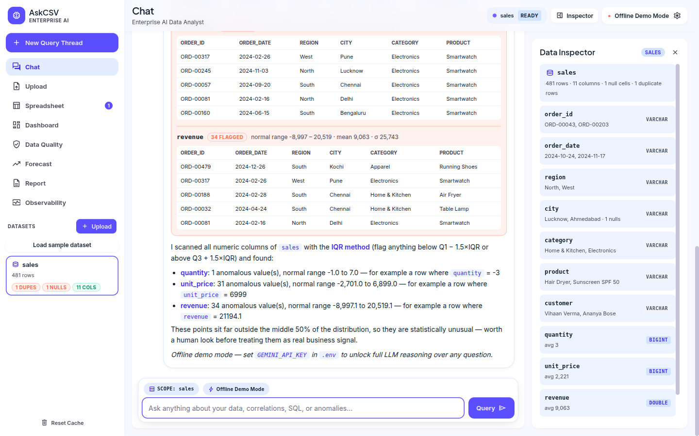
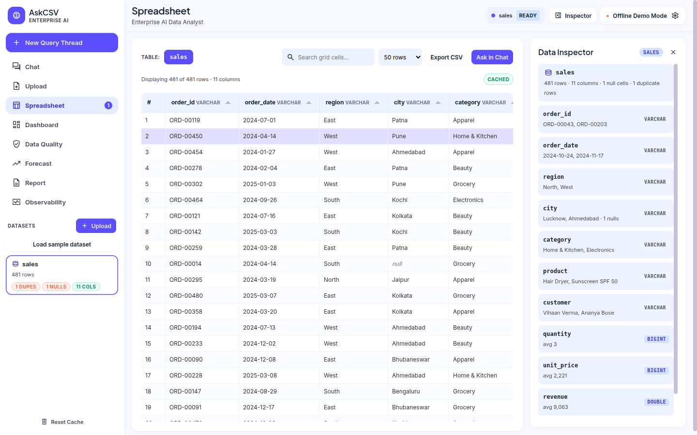
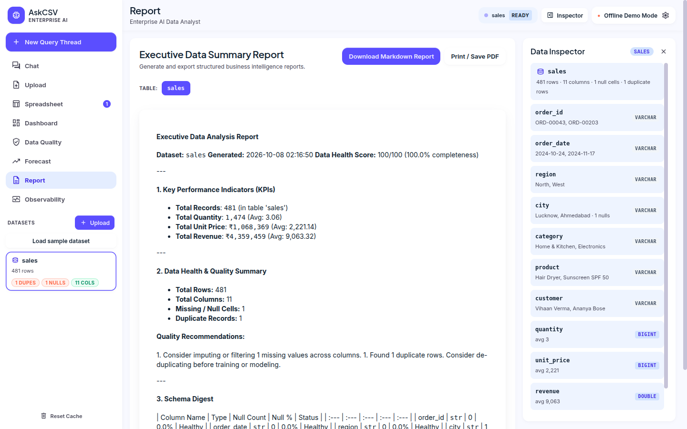
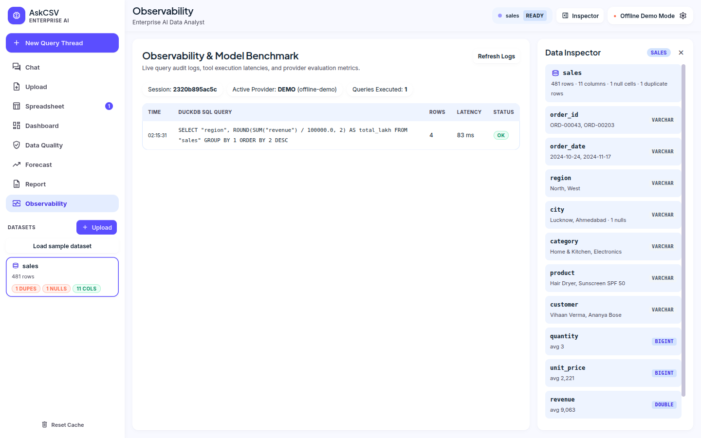
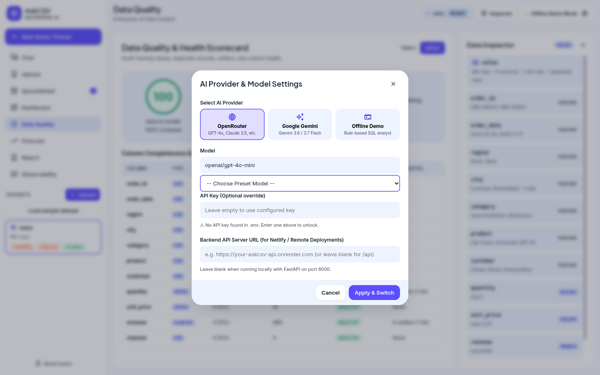
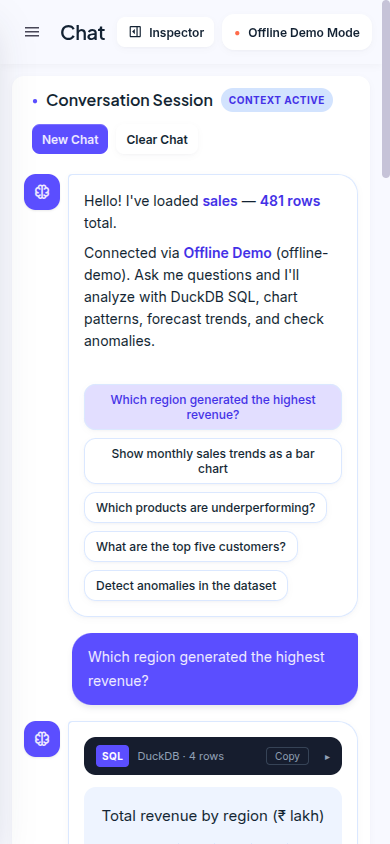
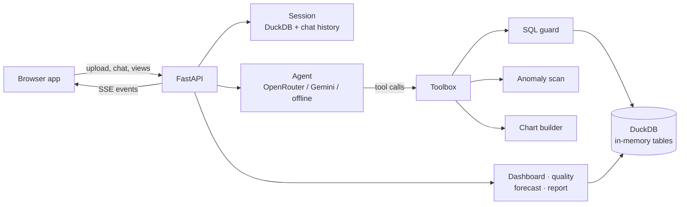

# AskCSV

**Ask your spreadsheets questions. Get SQL, charts and evidence back.**

AskCSV is a web app where you drop in CSV or Excel files and chat with them. A language model plans the analysis, DuckDB runs the SQL, and you see the query, the numbers, a chart and a short explanation. The same data also feeds a one-click dashboard, a data-health audit, a trend forecast and a printable report.

It was built as a submission for the **Digital Back Office Ltd. AI Engineer assignment**.


---

## Contents

1. [Tour of the app](#tour-of-the-app)
2. [How it maps to the brief](#how-it-maps-to-the-brief)
3. [Run it](#run-it)
4. [Choosing an AI provider](#choosing-an-ai-provider)
5. [How it works](#how-it-works)
6. [Repository map](#repository-map)
7. [HTTP API](#http-api)
8. [Sample data](#sample-data)
9. [Safety model and limits](#safety-model-and-limits)

---

## Tour of the app

**Start** — drop files or load the bundled sample. Works with no API key.


**Datasets** — several files at once; each Excel sheet becomes its own table.


**Chat** — streaming answers, collapsible SQL, interactive charts, and follow-up questions that remember context (see the image at the top).

**Anomalies** — outliers per numeric column with the allowed range, mean, spread and example rows.



**Dashboard** — headline numbers and breakdown charts generated from the table's columns.


**Data quality** — a 0–100 health score, missing values, duplicates and a per-column matrix.


**Forecast** — pick a date and a metric; get a trend line with a confidence band.


**Spreadsheet** — sortable, searchable, paginated view of any loaded table.



**Report** — a written summary you can download as Markdown or print to PDF.



**Observability** — every SQL statement the agent ran, with row counts and timings.



**Provider settings** — switch between OpenRouter, Gemini and the offline analyst.



**On a phone** — the navigation becomes a slide-out drawer.



> A short screen recording is not included yet. Drop one at `screenshot/demo.mp4` and link it here.

---

## How it maps to the brief

**Required**

| Brief item | Where it lives |
|---|---|
| Upload and validate CSVs | `/api/upload` checks extension and size (50 MB default), repairs banner-style header rows, and handles multi-sheet Excel. |
| Natural-language questions | Agent loop with tool calling over OpenRouter or Gemini. |
| Insights and summaries | The model is instructed to aggregate first and quote only returned numbers; the Report view adds a written overview. |
| Charts | `build_chart` returns Plotly specs: bar, line, area, scatter, pie, donut, histogram. |
| SQL and/or Pandas | SQL, always shown beside the answer. There is no Pandas code generation. |
| Anomalies with reasons | IQR or z-score scan, reported with bounds and sample rows. |
| Explained reasoning | Live "running tool…" status, visible SQL, and a plain-language rationale. |
| Conversation memory | Per-session message history; *New Query Thread* clears it without unloading data. |

**Optional extras**

| Extra | State |
|---|---|
| Multi-file analysis | Done. All tables share one DuckDB session, so joins work. |
| Dashboard | Done. |
| Data-quality checks | Done. |
| Forecasting | Done, as a linear trend. |
| Agentic workflow | Done. Up to 8 tool steps, with SQL errors fed back so the model can repair its query. |
| Tool calling | Done: `run_sql`, `build_chart`, `detect_anomalies`, `profile_schema`. |
| Streaming | Done, over Server-Sent Events. |
| Report export | Done: Markdown, print/PDF, and CSV for large results. |
| Logging and observability | Done, per session. |
| Caching | Partial: tables stay loaded per session and the browser caches previews. No LLM-response cache. |
| Authentication | Not done. See [Safety model](#safety-model-and-limits). |
| Semantic search | Not done. |
| Evaluation harness | Not done. |

**Questions it handles out of the box:** highest-revenue region, monthly sales trend, underperforming products, top five customers, "generate SQL for this", and "detect anomalies".

---

## Run it

### With Python

```bash
git clone https://github.com/mayankrajray/ask-csv.git
cd ask-csv
python -m venv .venv
source .venv/bin/activate          # Windows: .venv\Scripts\activate
pip install -r requirements.txt
cp .env.example .env               # optional: add a provider key
uvicorn app.main:app --reload
```

Open <http://localhost:8000>.

### With Docker

```bash
docker compose up --build
```

### Tests

```bash
pip install -r requirements-dev.txt
pytest
```

---

## Choosing an AI provider

Set values in `.env` or use the settings dialog (the gear in the top bar).

| Provider | Variables | Notes |
|---|---|---|
| OpenRouter | `OPENROUTER_API_KEY`, `OPENROUTER_MODEL` | Any tool-capable model, e.g. `openai/gpt-4o-mini`. |
| Google Gemini | `GEMINI_API_KEY`, `GEMINI_MODEL` | Uses native function calling. |
| Offline | none | A rule-based analyst for the example questions; useful for demos and tests. |

Choosing OpenRouter or Gemini without a key is rejected with a clear error rather than silently falling back to the offline analyst.

---

## How it works



**One question, step by step**

1. The browser posts the message to `/api/chat`.
2. The agent receives the message plus a digest of every loaded table's schema.
3. The model calls tools. `run_sql` goes through the guard and then DuckDB; failures come back as text so the model can correct itself.
4. Only the first 20 rows of any result are shown to the model; the full result is saved as a downloadable CSV.
5. The server streams status, SQL, chart and anomaly events, then the answer text, as they happen.

**Why SQL instead of retrieval over embeddings:** averages, ranks and growth rates need exact arithmetic over every row, which a database does and a vector search does not.

---

## Repository map

```
app/
  main.py              routes, sessions, SSE streaming
  config.py            environment settings and limits
  engine.py            DuckDB wrapper, SQL guard, header repair
  tools.py             the four agent tools
  agent.py             Gemini agent
  openrouter_agent.py  OpenRouter agent
  demo_agent.py        offline analyst
  anomalies.py         IQR / z-score detection
  charts.py            Plotly spec builder
  analytics.py         dashboard, quality, forecast, report
frontend/              plain HTML/CSS/JS single-page app (+ vendored Plotly, Tabulator)
data/                  sample CSV and its generator
tests/                 engine, guard and API tests
screenshot/            images used above
ref/DESIGN.md          visual design spec the UI follows
```

---

## HTTP API

| Route | Method | Purpose |
|---|---|---|
| `/api/health`, `/api/config` | GET | Active provider, model and which keys exist |
| `/api/config/switch` | POST | Change provider, model or key |
| `/api/upload` | POST | Upload files into a new session |
| `/api/sample` | POST | Load the sample dataset |
| `/api/chat` | POST | Ask a question; replies as an SSE stream |
| `/api/chat/new` | POST | Clear conversation memory |
| `/api/schema/{sid}/{table}` | GET | Column statistics |
| `/api/preview/{sid}/{table}` | GET | Paged rows |
| `/api/dashboard/…`, `/api/quality/…`, `/api/forecast/…`, `/api/report/…` | GET | Analysis views |
| `/api/logs/{sid}` | GET | SQL audit trail |
| `/api/exports/{sid}/{file}` | GET | Full CSV of a large result |

---

## Sample data

`data/sales.csv` holds 482 retail orders over 14 months (order, region, city, category, product, customer, quantity, price, revenue, channel). It deliberately contains a few revenue spikes, one negative quantity, one blank city and one repeated row so the anomaly and quality screens have something to find. `python data/make_sample_dataset.py` rebuilds it.

---

## Safety model and limits

**Protections**

* **Query guard.** Generated SQL must be one read-only statement. The guard blanks out string literals and quoted names before checking keywords, rejects file and URL readers, and asks DuckDB's own parser to confirm there is exactly one query.
* **Locked database.** After data loads, DuckDB's file and network access is switched off and its settings are frozen, so a missed case still cannot read the host's files. Files are parsed with pandas, never with SQL readers.
* **Table checks.** Every per-table route verifies the name against the session's tables.
* **Errors.** Server faults are logged; clients get a generic message.
* **CORS.** Only `ALLOWED_ORIGINS` (localhost by default), GET and POST, no credentials.

**Limits you should know about**

* No user accounts. Sessions are identified by a long random ID, and `/api/config/switch` changes provider settings for the whole server. On shared hosting set `ALLOW_KEY_OVERRIDE=false` and supply keys through environment variables.
* State is in memory: restarting the server drops sessions, and uploaded files are not purged automatically.
* The forecast is a straight-line trend, with no seasonality.
* Offline mode only recognises the example question styles.
* The page fetches fonts and icons from Google Fonts; without internet, icons render blank.
