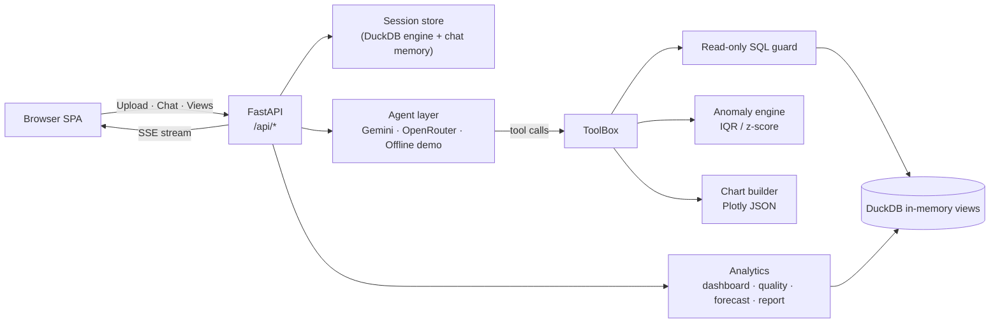

# AskCSV — AI Data Analyst for your CSV files

**Talk to your data.** Upload one or more CSV or Excel files and ask questions in plain English. AskCSV writes read-only DuckDB SQL, runs it, draws interactive charts, flags statistical anomalies, forecasts trends, audits data quality, and shows its reasoning at every step.

> Built for the **Digital Back Office Ltd.** *AI Engineer Assignment*.


---

## Screenshots

| | |
|---|---|
| **Welcome** — drop files or load the sample<br> | **Upload & datasets** — multi-file, multi-sheet<br> |
| **Chat + SQL + charts** — streamed answers with collapsible SQL<br> | **Anomaly detection** — IQR bounds and flagged rows<br> |
| **Dashboard** — auto KPIs and breakdown charts<br> | **Data quality** — health score and column matrix<br> |
| **Forecast** — linear trend with confidence band<br> | **Spreadsheet** — searchable, paginated grid<br> |
| **Report** — executive summary, print to PDF<br> | **Observability** — SQL audit log and latencies<br> |
| **Provider settings** — OpenRouter, Gemini or offline demo<br> | **Mobile** — slide-out navigation<br> |

> **Demo video:** a 10–30 s walkthrough of the new UI is not yet recorded. Add it as `screenshot/demo.mp4` and link it here.

---

## Assignment coverage

### Core features

| Requirement | How AskCSV delivers it |
|---|---|
| Upload and validate one or more CSV files | Multi-file upload of `.csv`, `.xlsx`, `.xls`. Extension and size (default 50 MB) are validated, banner header rows are detected, and each Excel sheet becomes its own table. |
| Natural-language Q&A | Gemini or OpenRouter models call tools; answers are computed from real SQL results. |
| Business insights and summaries | Aggregation-first prompting; the Report tab produces a Markdown executive summary. |
| Charts (bar, line, pie, scatter, …) | The `build_chart` tool emits Plotly specs (bar, line, area, scatter, pie, donut, histogram), rendered client-side. |
| SQL and/or Pandas code | Every answer exposes the exact DuckDB SQL (collapsible, copyable). SQL only; no Pandas code generation. |
| Anomaly detection with explanation | IQR and z-score (>3σ) per numeric column, showing bounds, mean, σ and sample flagged rows. |
| Explain reasoning | Live status events (`Running run_sql…`), visible SQL, and a plain-English explanation of the method. |
| Conversation context | Multi-turn memory per session; **New Query Thread** resets memory but keeps loaded tables. |

### Example questions

* "Which region generated the highest revenue?"
* "Show monthly sales trends."
* "Which products are underperforming?"
* "What are the top five customers?"
* "Generate SQL for this analysis."
* "Detect anomalies in the dataset."

### Bonus features

| Bonus | Status |
|---|---|
| Multi-file analysis | Implemented — every file or sheet is a DuckDB view; cross-table joins work |
| Dashboard generation | Implemented — KPI cards plus auto charts |
| Data quality checks | Implemented — 0–100 health score, nulls, duplicates, >3σ outliers |
| Forecasting | Implemented — linear trend with 95% band |
| Agentic workflows | Implemented — bounded tool loop (8 steps) that feeds SQL errors back to the model for self-correction |
| Tool calling | Implemented — `run_sql`, `build_chart`, `detect_anomalies`, `profile_schema` |
| Streaming responses | Implemented — Server-Sent Events |
| Export reports | Implemented — Markdown download, print/PDF, CSV for large results |
| Observability / logging | Implemented — per-session SQL log with latency and row counts |
| Caching | Partial — loaded tables stay in memory per session; the browser caches previews. No LLM or query-result cache |
| Authentication | Not implemented — the API key is set via `.env` or the settings dialog (see Known limitations) |
| Semantic search | Not implemented — grid search and a schema digest only |
| Evaluation framework | Not implemented — you can switch models, but there are no scored eval cases |

---

## Quick start

### Local

```bash
git clone https://github.com/mayankrajray/datapilot-ai.git
cd datapilot-ai
cp .env.example .env        # optional: add OPENROUTER_API_KEY or GEMINI_API_KEY
python -m venv .venv && source .venv/bin/activate   # Windows: .venv\Scripts\activate
pip install -r requirements.txt
uvicorn app.main:app --reload
```

Open <http://localhost:8000>. Without an API key AskCSV runs in **offline demo mode**, a rule-based analyst that handles the example questions.

### Docker

```bash
docker compose up --build
```

### Tests

```bash
pip install -r requirements-dev.txt
pytest -v
```

---

## Architecture



**Design decisions**

* **Text-to-SQL, not RAG.** Tabular questions need exact arithmetic; DuckDB does it in-process.
* **Read-only SQL guard.** Single statement, `SELECT/WITH/DESCRIBE/SHOW/EXPLAIN` only, with a keyword denylist.
* **Context protection.** At most `MAX_ROWS_TO_LLM` (20) rows reach the model; larger results are written to a downloadable CSV.
* **Self-correcting loop.** DuckDB errors go back to the model so it can fix its own SQL.
* **Offline fallback.** The app is fully usable with no API key.

---

## Project layout

```
app/
  main.py              FastAPI routes, SSE streaming
  config.py            Environment config and limits
  engine.py            DuckDB engine, SQL guard, header cleanup
  agent.py             Gemini function-calling agent
  openrouter_agent.py  OpenRouter tool-calling agent
  demo_agent.py        Offline rule-based agent
  tools.py             run_sql, build_chart, detect_anomalies, profile_schema
  anomalies.py         IQR and z-score detection
  analytics.py         Dashboard, quality, forecast, report
  charts.py            Plotly spec builder
frontend/              Vanilla JS SPA (index.html, css/app.css, js/app.js, vendor/)
data/                  sales.csv sample and its generator
tests/                 Engine and API tests
screenshot/            README images
ref/                   Design system spec (DESIGN.md)
```

### API

| Route | Method | Purpose |
|---|---|---|
| `/api/config`, `/api/config/switch` | GET, POST | Provider and model status / switching |
| `/api/upload`, `/api/sample` | POST | Load files or the sample dataset |
| `/api/chat`, `/api/chat/new` | POST | Chat (SSE) and reset conversation memory |
| `/api/schema/{sid}/{table}`, `/api/preview/{sid}/{table}` | GET | Column profile and paged rows |
| `/api/dashboard/…`, `/api/quality/…`, `/api/forecast/…`, `/api/report/…` | GET | Analytics views |
| `/api/logs/{sid}` | GET | Query audit log |
| `/api/exports/{sid}/{file}` | GET | Full CSV of large results |

---

## Sample dataset

`data/sales.csv` — 482 rows of retail sales (orders, regions, cities, categories, products, customers, quantity, revenue) over 14 months, with planted anomalies: revenue spikes, a negative quantity, a missing city, and a duplicate row. Regenerate with `python data/make_sample_dataset.py`.

---

## Assumptions and known limitations

* **Single-tenant by design.** Sessions live in memory and are lost on restart; uploads and exports are not cleaned up automatically.
* **No authentication.** `/api/config/switch` changes the provider, model and API key for the whole server. Do not expose this deployment publicly without adding auth or removing that endpoint.
* **SQL sandbox is a denylist.** It blocks writes, but DuckDB file/URL readers are not disabled. Do not run it against untrusted users without hardening (disable external access on the connection).
* **Forecasting is a simple linear trend**, not a seasonal model.
* **Offline demo mode** only understands the example question patterns.
* The UI loads fonts and icons from Google Fonts; offline, icons fall back to blank squares.
