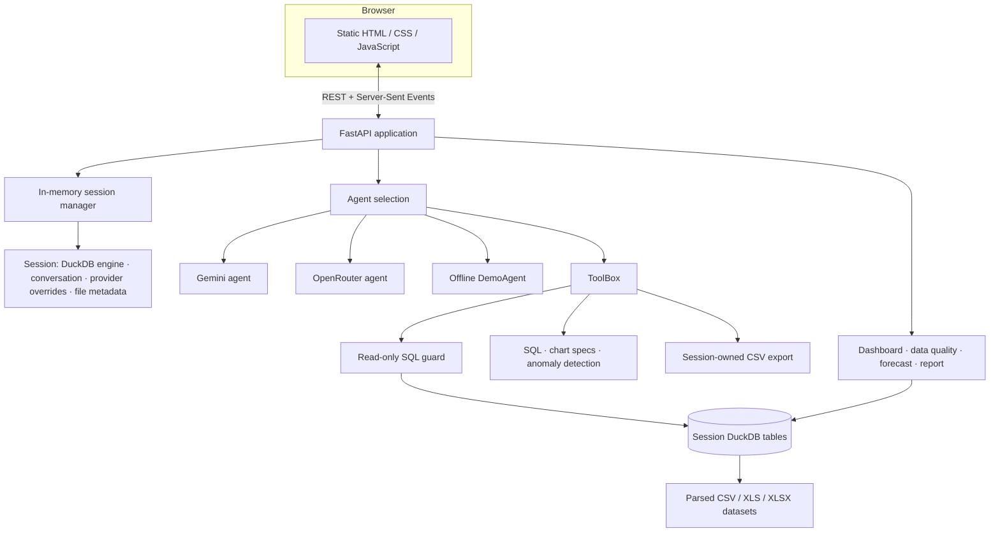
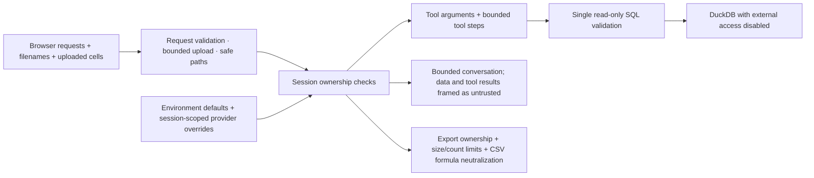

# AskCSV Architecture

## Request and analysis flow

The frontend is served by FastAPI from `frontend/`; the repository has no npm build pipeline. An external static frontend can set `window.ASKCSV_API_BASE` or the supported browser setting to point at the API, with its origin added to `ALLOWED_ORIGINS`.

## Agent providers

The configured provider selects Gemini or OpenRouter when a usable key is present. If neither provider is configured, the application runs with DemoAgent, which uses deterministic patterns and local tools without an external API. Provider configuration overrides belong to the in-memory session. Tool calls flow through `ToolBox`; model-provided SQL is checked before DuckDB executes it.

## Analytics and tools

ToolBox exposes SQL execution, chart construction, anomaly detection, schema profiling, and CSV export. The API exposes dashboard summaries, data-quality analysis, linear forecasting, reports, schema and preview routes. CSV/XLS/XLSX inputs are parsed as dataframes and loaded into the session’s DuckDB engine; join queries can reference multiple session tables.

## Security and lifecycle boundaries

The controls reduce exposure but do not provide user authentication. Session IDs are bearer capabilities. Sessions and provider overrides live in process memory; uploads and exports are local files with retention cleanup and are not shared durable storage for multi-worker deployments. Prompt-injection handling is a mitigation, not a guarantee.

## Runtime configuration

Environment variables and defaults are listed in [README.md](../README.md#environment-configuration) and `.env.example`. Docker Compose forwards the provider settings and configurable limits. Do not bake `.env` credentials into an image.
